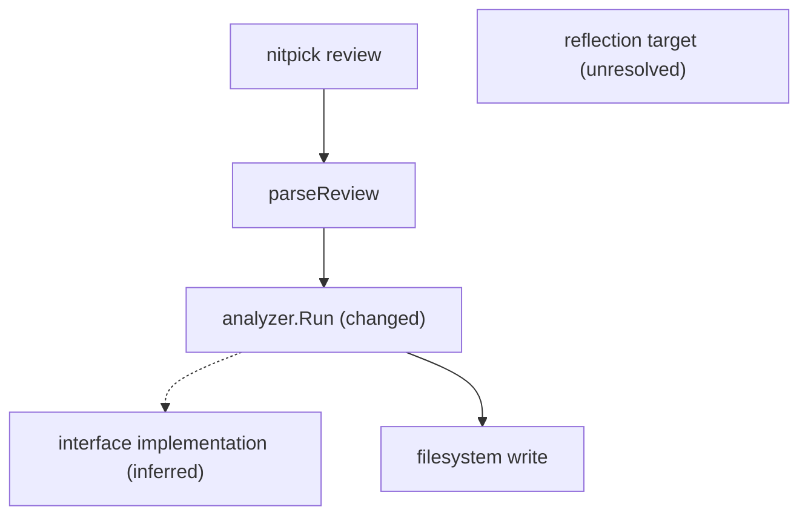

# PR application-flow diagrams plan

Status: approved for issue #124. Implementation follows the product decisions
recorded here.

Implementation note: the extractor uses Go's parser and type checker with an
in-memory module index, inside a bounded worker process. This replaces the
proposed packages/SSA loader: project package drivers, dependency downloads,
generators, and compilation of repository code are unnecessary for the direct
relationships supported here. Missing external metadata and dynamic dispatch
remain explicit partial coverage. The canonical result lives in `internal/prflow`;
`internal/prdiagram` renders its graph projection. The rollout remains off by
default while broader repository qualification continues. Changed roots take
priority over context, but hard graph and publication limits can still omit
roots; the output reports those omissions instead of exceeding its budgets.

## Product contract

For a pull-request review, open-nitpick will produce a deterministic,
source-linked view of the application paths affected by the change. The view
will explain that it represents static source relationships, not a runtime
trace or proof of complete application coverage.

The existing review summary will contain one bounded, collapsible
**Application flows** section. It will include named flows, a Mermaid diagram,
an accessible text/evidence table, changed and unchanged status, relationship
legend, and a coverage panel. The same rendered section will appear in local
dry-run output and the GitHub Actions job summary. A versioned JSON result will
be available from the standalone command and an optional local output path. v1
does not promise a downloadable GitHub artifact or emit a dead link to one;
repositories that want retention can upload the generated file in their own
workflow.

The feature is independent of the LLM review and of `review.summary`. It makes
no model calls and does not consume the review token budget. Turning narrative
summary off does not hide flow coverage, failures, or limits. A flow failure
never removes findings or changes the existing review gate; it is reported as
`partial`, `unavailable`, or `failed`.

## Canonical data model

Keep the public domain model in `internal/prdiagram`, with extraction in a
separate package. Define a versioned result containing:

- repository identity, base/head revision, generator version, Go build context,
  selected scope, and deterministic ordering metadata;
- nodes with stable symbol IDs, kind, label, declaration evidence, revision,
  and change state (`added`, `modified`, `unchanged`, `removed`);
- edges with stable IDs, source/target IDs, relation kind, resolution
  (`resolved`, `inferred`, `unresolved`), reason code, and call-site evidence;
- explicit unresolved boundary nodes for dynamic or unavailable targets;
- coverage counts and omissions for files, declarations, packages, build tags,
  generated code, missing metadata, limits, and loader errors;
- result status: `complete`, `partial`, `no_flow`, `skipped`, `unavailable`, or
  `failed`. `skipped` means mode off or no eligible language; `no_flow` means
  an eligible scan found no reachable path; `complete` means the declared
  static scope finished; `partial` means limits or missing metadata reduced
  it; `unavailable` means a source or loader precondition could not be
  established; and `failed` means an internal contract error. Only `complete`
  claims full declared-scope resolution.

`complete` means the declared static scope finished within its limits. It never
means that runtime behavior was exhaustively discovered. Empty output must
carry a status and explanation, so no-flow cannot look like a clean review.

Declaration evidence and call-site evidence remain separate. An external call
can link to its local call site; it cannot claim a declaration in this
repository. Removed symbols link to the base revision, while current symbols
link to the immutable head revision.

## Reproducible Go analysis

Introduce an extractor boundary such as:

```go
type Request struct {
    Base, Head Revision
    Changes    diff.Files
    Source     RevisionSource
    Options    Options
}

func Analyze(context.Context, Request) (Result, error)
```

`RevisionSource` must read a bounded, immutable snapshot at the reviewed
revision. GitHub uses the PR head repository and full head SHA; fork heads are
handled explicitly. Local working-tree output identifies an uncommitted
snapshot and does not fabricate a web URL. The extractor must not accept a
mutable branch URL supplied by configuration.

Use a pinned `golang.org/x/tools/go/packages` loader with syntax, types, and
types-info, and `go/ssa` for direct-call identity; do not use whole-program
pointer analysis in v1. Run the loader through a reaped, time-bounded `go`
subprocess with `GOTOOLCHAIN=local`, `GOPROXY=off`, `GOSUMDB=off`, `GOWORK=off`,
`-mod=readonly`, and `CGO_ENABLED=0`. It may read only the materialized
snapshot and explicitly allowed read-only module cache. It may not run project
generators, tests, cgo commands, arbitrary package drivers, or automatic
toolchain downloads. Missing dependencies, invalid syntax, unsupported build
contexts, unsafe replacements, and generated-code boundaries become coverage
diagnostics rather than guessed relationships. Checked-in generated Go can be
parsed and labeled; its generator is never executed. On timeout, kill and reap
the subprocess and return a partial or unavailable result promptly.

Build a package/declaration index and reverse caller index across selected local
modules. Seed from all changed declarations in current files, using both old
and new hunk ranges so removal-only edits are not lost. Deleted declarations
are represented in a base-side view. Traverse upward toward command roots and
downward toward meaningful callees and side-effect boundaries with bounded,
deterministic breadth-first search. Preserve dispatch/configuration functions,
recursion, and cycles. Do not use `internal/bundle/callers.go` as resolution
truth: it is a bounded context collector.

Resolve direct package/function/method calls, promoted methods, method
expressions, generics where type identity is available, closures, `go`, and
`defer`. Treat callback registration as a relationship and callback execution
as inferred unless a supported adapter proves the chain. Interface calls with
multiple possible receivers, function variables, reflection, plugins,
generated metadata, and unavailable package information remain unresolved or
inferred with a reason. Solid edges are exact; dashed edges are justified
candidates; unresolved edges are explicit boundaries.

The first adapter recognizes standard-library CLI dispatch, including the
repository's `main → run → os.Args` switch shape, and labels observed analyzer,
model, filesystem, network, and persistence calls by resolved API identity.
The graph contract must not depend on a CLI or HTTP framework. Gin and other
HTTP adapters consume it in a later milestone.

## Limits and output

Keep analysis limits separate from display limits. Proposed hard defaults are a
15-second deadline, 2,000 Go files and 32 MiB source, eight caller levels, four
callee levels, 30 nodes and 50 edges per inline flow, three inline flows, and
500 nodes/1,000 edges and 2 MiB for JSON. These are launch candidates, not
measurements. Sort by stable symbol/source identity before applying caps;
changed roots are always retained and every omission has a count and reason.
Mermaid output is capped at 48 KiB; over-limit output falls back to the
text/evidence table with an omission notice and no unavailable artifact link.
Use several small entrypoint flows instead of one unreadable repository graph.

The renderer must use separate Mermaid and Markdown escaping. Empty labels,
punctuation, Unicode, quotes, pipes, backticks, HTML-like text, and hostile
input must remain valid and inert. Mermaid syntax is checked with a parser/render
smoke test, not only string assertions. The evidence table remains meaningful
when Mermaid is unavailable, and changed status is conveyed by text, labels,
and line styles as well as color. Mobile tables wrap; large graphs report
their omissions instead of silently dropping nodes or linking to an artifact
that v1 does not publish.

## Review and CLI integration

Run flow analysis after policy resolution and draft/skip-marker checks, once the
PR head is pinned and the complete diff is parsed, but before incremental
narrowing used by the LLM review. Preserve the complete policy-filtered diff
for the builder; incremental review may narrow model context, but diagrams
always describe that full scope.

Extend `review.Report` with an optional flow result without folding its status
into `PipelineComplete` or `reusableCoverage`. Extend the existing render path
so `review.Render` appends the bounded flow section, and let the existing
`vcs.Review.Summary`, GitHub publisher, local provider, and Actions summary
carry it. Skipped and draft reviews publish nothing. Provider/source-link
errors remain visible and do not turn into fabricated links.

Add a standalone command with the same analyzer and output contract. Its
default is the local working tree (`HEAD` as the base); explicit `-base` and
`-head` select committed revisions. `-output -` means stdout; a named path is
written atomically. The command never publishes. An explicit mode of `off` is a
usage error rather than silent output.

```text
nitpick flow -base <rev> -head <rev> -format markdown|json -output <path>
```

Support `-entry package.Func` or `-entry path/to/file.go:line`, validated
limits, timeout, unchanged context, build tags, and exclusions. Use one
coherent `flow` namespace: `mode`, `max_files`, `max_bytes`,
`max_depth_callers`, `max_depth_callees`, `max_nodes`, `max_edges`, `max_flows`,
`timeout`, `include_unchanged`, `entrypoints`, `exclude`, and `build_tags`.
CLI flags override config, config overrides built-ins, and malformed explicit
values fail before source reads. `auto` runs only for eligible changed Go
files; `on` reports unsupported/no-flow status visibly; `off` reports
`skipped`. The rollout default is proposed as `off` until qualification, then
`auto` in the release that includes benchmark evidence. Generate
configuration-reference docs.

Expose the same versioned result in the existing MCP `review` output as a
compact `flow` field. Add a non-publishing MCP `flow` tool only if callers need
options unavailable through `review`; its base/head, working-tree, entry, and
output semantics must match the CLI.

## Reviewer-facing example

The compact output is intended to read like this (the SHA and paths are
illustrative):

````markdown
### Application flows (static analysis)
This describes source relationships at `abc1234`, not runtime order.
Solid = resolved; dashed = inferred; boundary = unresolved.

<details><summary>nitpick review → parseReview → changed analyzer</summary>



| Element | Relation/status | Evidence |
| --- | --- | --- |
| `nitpick review` | unchanged node | [cmd/nitpick/main.go:42](<https://github.com/example/app/blob/abc1234/cmd/nitpick/main.go#L42>) |
| `analyzer.Run` | modified node | [internal/analyzer/run.go:19](<https://github.com/example/app/blob/abc1234/internal/analyzer/run.go#L19>) |
| filesystem write | resolved edge | [internal/analyzer/run.go:44](<https://github.com/example/app/blob/abc1234/internal/analyzer/run.go#L44>) |
| interface implementation | inferred edge | [internal/analyzer/run.go:31](<https://github.com/example/app/blob/abc1234/internal/analyzer/run.go#L31>) |
| reflection target | unresolved boundary: `reflection` | [internal/analyzer/run.go:52](<https://github.com/example/app/blob/abc1234/internal/analyzer/run.go#L52>) |

Coverage: partial — 18 files, 11 nodes, 14 edges; one reflection target and
one missing dependency could not be resolved.
</details>
````

Disconnected components are named by their nearest supported entrypoint, then
by stable package/symbol order. A library with no discoverable root is named by
its changed symbol and reports `root_not_found`; this is not a failed scan.

## Revision, roots, and publication rules

Every evidence location carries a revision and repository identity. PR head
locations use the head repository plus full `HeadSHA`; removed locations use
the base repository plus full `BaseSHA`. A fork head never gets a link built
from the base repository. GitHub and Enterprise providers supply the web origin
and repository separately from API endpoints. Paths are URL-escaped only after
repository-relative, non-symlink containment validation. Local dirty reviews
use `working-tree:<content-digest>` evidence and a plain `path:line` label; no
fake `blob/main` link is emitted. Renames preserve identity when symbols match;
deleted symbols appear in a separate **Removed flows** evidence table and are
never linked to the head tree.

Automatic roots are all changed declarations after resolved policy exclusions.
The builder follows callers toward standard `os.Args`/`flag` CLI roots and
callees toward a fixed v1 boundary catalog: `os.WriteFile`/`os.Remove`,
`net/http` client/server calls, `database/sql` operations, subprocess
execution, and configured model/analyzer entrypoints. A root with no supported
entrypoint is retained as a symbol flow with `root_not_found`. `-entry` accepts
only a fully qualified `package.Func` or an existing repository-relative
`path:line`; ambiguous or absent entries fail before analysis. Roots, flow
names, nodes, edges, and omissions are sorted by stable ID and source location.

GitHub review bodies have an aggregate byte cap. Before publication, preserve
the disclaimer, coverage/status, every changed root, and its evidence rows;
drop the least-connected unchanged context first, then Mermaid, while retaining
the text table. The result says exactly what was omitted and never links to a
local file. A flow marker includes schema, generator, head SHA, and options
digest, so retries remain recognizable in the existing review body. Flow
publication failure leaves ordinary findings and reports `failed`; it never
turns a completed review into an apparently clean result. Drafts, skip markers,
and policy failures do not analyze or publish flows.

The status matrix is visible in text and JSON:

| Status | PR/local output | Review gate |
| --- | --- | --- |
| `skipped` | mode or eligibility reason | unchanged |
| `no_flow` | explicit “no path resolved; not evidence of no effect” | unchanged |
| `complete` | diagram/table and scope counts | unchanged |
| `partial` | diagram/table plus limits and unresolved reasons | unchanged |
| `unavailable` | loader/source reason and no fabricated links | unchanged |
| `failed` | bounded failure message and diagnostics | unchanged unless the normal review failed |

## Acceptance boundary

The feature is ready only when a real open-nitpick change produces a readable
CLI-root flow in a dry-run and a GitHub-shaped published review, with exact
head-SHA links, unchanged context, inferred and unresolved relationships, and a
truthful partial result for missing metadata. The standalone CLI and MCP output
must serialize the same result. The Mermaid smoke check is pinned to a tested
renderer fixture in CI; the Go test suite also has a deterministic grammar and
injection guard so renderer correctness does not depend on a developer's Node
installation. Links-only output is the default privacy posture: labels, paths,
line numbers, and URLs are retained; source snippets are not copied into PR
reviews or JSON unless a later explicit option is designed and reviewed.

## Test and qualification plan

Add fixtures and integration tests for:

- `nitpick` command dispatch through configuration to a changed function and
  analyzer/model/filesystem boundary;
- ordinary calls, method resolution, generics, recursion, cycles, callback and
  hook chains, interface ambiguity, reflection, generated code, build tags,
  missing dependencies, and unavailable metadata;
- changed/unchanged nodes, added files, rename, deletion-only edits, removed
  declarations, changed package/configuration declarations, and empty scope;
- exact base/head SHA links, fork identity, local working-tree evidence, safe
  repository-relative paths, and rejection of mutable or unsafe URLs;
- graph caps, deterministic output despite file-order concurrency, cancellation,
  timeout, loader failure, and truthful partial/no-flow statuses;
- Mermaid parser/render behavior and Markdown injection safety;
- review publication parity across GitHub, local dry-run, Actions summary,
  summary disabled, incremental review, skipped/draft review, and provider
  publication failure;
- mutation guards that break dispatch discovery, edge resolution, deletion
  seeding, evidence rows, changed markers, Mermaid escaping, and coverage
  notices and make the corresponding tests fail.

Qualify practical limits with cold/warm benchmarks on this repository, a large
synthetic module, a multi-module fixture, missing dependencies, and generated
code. Record measurements in `docs/findings.md`; do not present proposed limits
as established performance.

## Delivery sequence

1. Stabilize the canonical schema, immutable source-linker, renderer, statuses,
   limits, and golden/mutation tests.
2. Implement the reproducible Go parser/type index, change mapping, direct-call
   resolution, bounded traversal, CLI adapter, and coverage diagnostics.
3. Integrate the report/render/publish path, standalone command, config, local
   and Actions output, and end-to-end fixtures.
4. Run Mermaid/accessibility review, benchmarks, failure/cancellation tests,
   documentation generation, all repository gates, and a real dry-run review.
5. Enable `auto` only after the qualified output is readable and incomplete
   analysis is unmistakable; add Gin/HTTP adapters as a follow-on.

## Approved decisions

v1 ships with `flow.mode: off` while qualification runs, then can move to
`auto` for changed Go files after benchmark and rendering evidence. It uses the
existing review, Actions, and local surfaces with optional JSON or Markdown
output; it does not require an artifact upload. Evidence is links-only, roots
come from changed declarations and supported CLI context with explicit
overrides, and Gin/HTTP adapters remain follow-on work.
